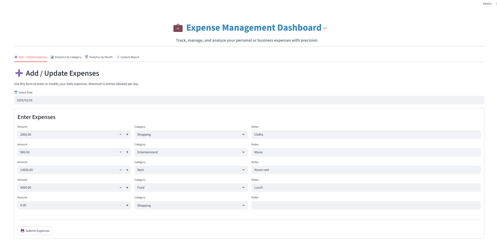
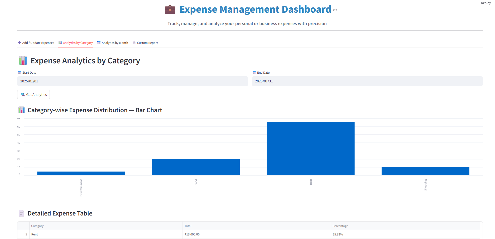
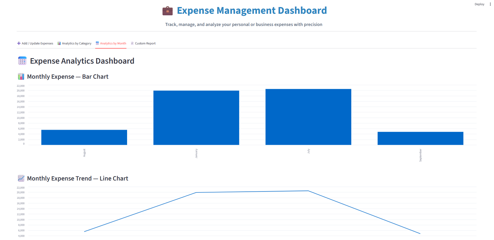
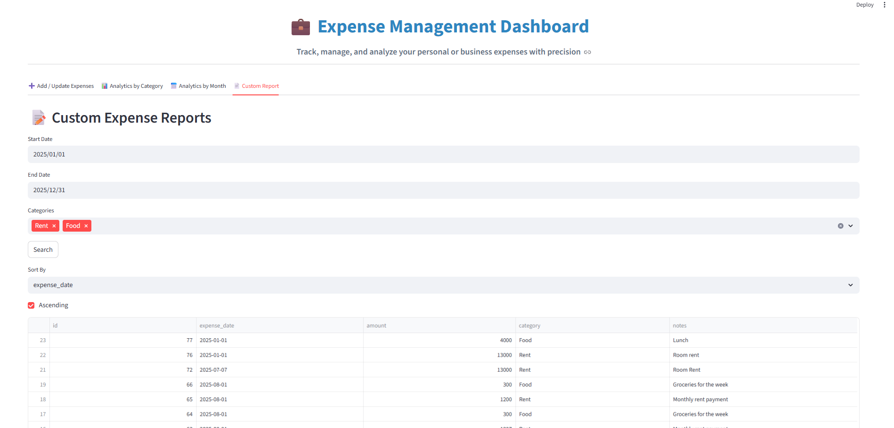

# Expense Management Dashboard







This project is an expense management dashboard that consists of a Streamlit frontend application and a FastAPI backend server.
It allows users to manage their expenses, view analytics, and interact with a MySQL database.

## Features
- **Expense Management**: Add, update, and delete expenses.
- **Analytics**: View analytics by category and month.

## Project Structure

- **frontend/**: Contains the Streamlit application code.
- **backend/**: Contains the FastAPI backend server code.
- **tests/**: Contains the test cases for both frontend and backend.
- **database/**: Contains the SQL file to set up the MySQL database.
- **server/**: Contains the FastAPI server code.
- **.gitignore**: Specifies files and directories to ignore in the Git repository.
- **requirements.txt**: Lists the required Python packages.
- **README.md**: Provides an overview and instructions for the project.

## Setup Instructions

1. **Clone the repository:**
   ```bash
   git clone https://github.com/SurajK221b/expense-dashboard-python-streamlit.git
   cd expense-dashboard-python-streamlit
   ```

2. **Set up the database:**
   - Import the SQL file from the `database` folder into MySQL (e.g., using MySQL Workbench).
   - This will create a database named `expense-manager`.

3. **Install dependencies:**
   ```bash
   pip install -r requirements.txt
   ```

4. **Run the FastAPI server:**  
   ```commandline
   uvicorn server.server:app --reload
   ```
   If this does not work, try:
   ```commandline
   cd expense-dashboard-python-streamlit/frontend
   fastapi dev .\server.py
   ```
5. **Run the Streamlit frontend:**
   ```bash
   streamlit run frontend/app.py
   ```
